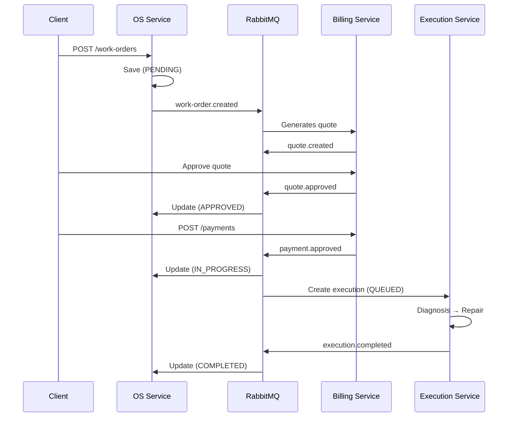
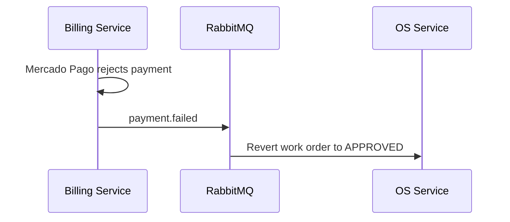
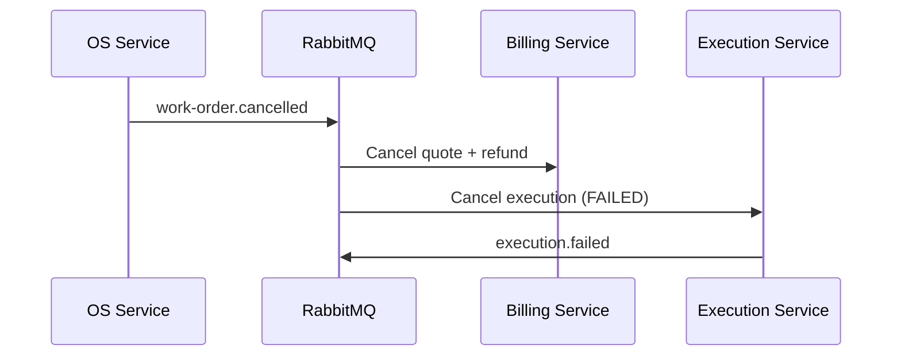
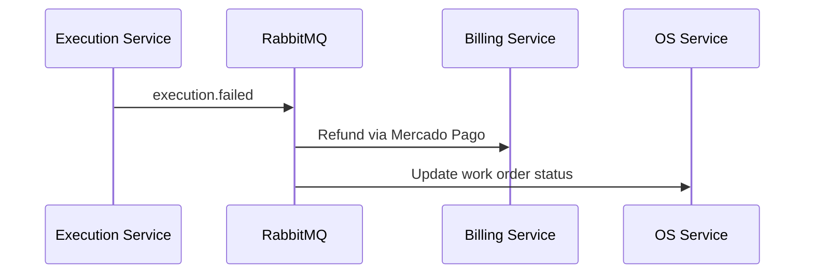

# Architecture

## System Overview

The garage management system is decomposed into 3 independent microservices following domain-driven boundaries. Each service owns its data, communicates asynchronously via RabbitMQ events, and exposes synchronous REST APIs for external consumers.

## Services

| Service | Responsibility | Database | Port |
|---------|---------------|----------|------|
| **OS Service** | Work orders, customers, vehicles | PostgreSQL 15 | 3001 |
| **Billing Service** | Quotes, payments, parts catalog, service catalog | MongoDB 7 | 3002 |
| **Execution Service** | Execution queue, diagnosis, repairs | PostgreSQL 15 | 3003 |

### OS Service (Entrypoint)

Manages the full lifecycle of work orders. Acts as the system entrypoint where customer interactions begin.

**Domain entities:** WorkOrder, Customer, Vehicle

**Database:** PostgreSQL (relational) — chosen for transactional integrity on work order state transitions and relational customer-vehicle associations.

### Billing Service

Handles financial operations: quote generation, payment processing via Mercado Pago, and catalog management for parts and services.

**Domain entities:** Quote, Payment, Part, ServiceCatalog

**Database:** MongoDB (NoSQL) — chosen for flexible document schemas on quote line items, payment gateway responses, and catalog data that varies in structure.

### Execution Service

Manages the physical execution of work orders: queue prioritization, technician assignment, diagnosis, and repair workflows.

**Domain entities:** Execution, Queue

**Database:** PostgreSQL (relational) — chosen for priority-based queue ordering and temporal queries on execution timestamps.

## Database Isolation

Each service owns its database exclusively. No service accesses another service's database directly. All cross-service data exchange occurs through:

1. **REST APIs** — for synchronous request/response operations
2. **RabbitMQ events** — for asynchronous state propagation

## Communication

### Synchronous (REST)

Used for client-facing CRUD operations and queries. Each service exposes its own REST API with Swagger documentation at `/api`.

### Asynchronous (RabbitMQ)

Used for inter-service event propagation. All services connect to a **single shared RabbitMQ instance** owned by the OS Service (entrypoint), using a `topic` exchange named `garage-events`. The other services join via the `garage-network` Docker network.

For full messaging documentation, see [MESSAGING.md](MESSAGING.md).

**Routing key pattern:** `{resource}.{action}`

| Event | Publisher | Consumers |
|-------|-----------|-----------|
| `work-order.created` | OS Service | Billing Service |
| `work-order.status-changed` | OS Service | Billing, Execution |
| `work-order.cancelled` | OS Service | Billing, Execution |
| `quote.created` | Billing Service | OS Service |
| `quote.approved` | Billing Service | OS Service |
| `quote.rejected` | Billing Service | OS Service |
| `quote.sent` | Billing Service | OS Service |
| `payment.created` | Billing Service | — |
| `payment.approved` | Billing Service | OS, Execution |
| `payment.rejected` | Billing Service | OS Service |
| `payment.failed` | Billing Service | OS Service |
| `execution.created` | Execution Service | — |
| `execution.status-changed` | Execution Service | OS Service |
| `execution.completed` | Execution Service | OS Service |
| `execution.failed` | Execution Service | Billing Service |

## Saga Pattern

### Implementation: Choreographed

We implement the **choreographed** variant of the Saga pattern. Each service listens to domain events and autonomously decides its next action, including compensation logic.

### Justification

| Factor | Choreographed | Orchestrated |
|--------|--------------|--------------|
| Coupling | Low — no central coordinator | High — orchestrator depends on all services |
| Single point of failure | None | Orchestrator |
| Scalability | Independent per service | Bottleneck at orchestrator |
| Complexity | Distributed in each service | Centralized in orchestrator |
| Fit for this system | Event-driven with RabbitMQ already in place | Would require additional orchestrator service |

### Happy Path Flow



### Compensation Scenarios

**Payment failure:**



**Work order cancellation:**



**Execution failure:**



## Authentication

All services implement a global JWT authentication guard. The guard validates Bearer tokens on every request except endpoints decorated with `@Public()`.

Public endpoints:
- `GET /health` (all services)
- `GET /public/work-orders/:id/status` (OS Service)

## Infrastructure

### Docker

Each service has a multi-stage `Dockerfile`:
- **Build stage:** `node:20-alpine`, installs dependencies, compiles TypeScript
- **Runtime stage:** `node:20-alpine`, copies only `dist/` and `node_modules/`

**Shared Infrastructure:** The OS Service `docker-compose.yml` creates a `garage-network` Docker network and the single shared RabbitMQ instance. Billing and Execution services declare this network as `external: true` and connect to the same RabbitMQ. OS Service **must be started first**.

### Kubernetes

Each service has `k8s/deployment.yaml` containing:
- **Deployment:** 2 replicas, resource limits (256Mi-512Mi RAM, 250m-500m CPU)
- **Service:** ClusterIP
- **ConfigMap:** Non-sensitive configuration
- **Secret:** Database credentials, RabbitMQ URL, JWT secret
- **Probes:** Liveness and readiness on `GET /health`

### CI/CD (GitHub Actions)

Each service has `.github/workflows/ci-cd.yaml`:

| Stage | Trigger | Actions |
|-------|---------|---------|
| **Test** | push, PR to main | `npm ci`, `npm run lint`, `npm run test:cov`, coverage >= 80% |
| **Quality** | after Test | SonarQube scan |
| **Build** | main only | Docker build, tag with commit SHA, push to AWS ECR |
| **Deploy** | main only | Update kubeconfig, `kubectl apply`, rollout status check |

### Branch Protection

- `main` branch requires PR with passing CI checks before merge

## Testing Strategy

| Type | Scope | Tool |
|------|-------|------|
| Unit tests | Services, controllers, guards | Jest |
| BDD tests | End-to-end business flows | Jest (Given/When/Then) |
| Coverage | Minimum 80% per service | Jest + istanbul |
| Quality gate | Code smells, vulnerabilities | SonarQube |
| Linting | Code style enforcement | ESLint + Prettier |

### Coverage Results

| Service | Statements | Branches | Functions | Lines | Tests |
|---------|-----------|----------|-----------|-------|-------|
| OS Service | 97.28% | 83.33% | 94.23% | 97.57% | 63 |
| Billing Service | 100% | 88.88% | 100% | 100% | 78 |
| Execution Service | 100% | 100% | 100% | 100% | 40 |

### BDD Flows

Each service has at least one complete BDD flow in `test/bdd/`:

- **OS Service:** Complete work order lifecycle + saga compensation (23 tests)
- **Billing Service:** Quote-to-payment flow + payment rejection compensation (10 tests)
- **Execution Service:** Queue-to-completion flow + cancellation compensation (12 tests)

## Observability

### Health Checks

Each service exposes `GET /health` (public, no auth):

```json
{
  "status": "ok",
  "service": "os-service",
  "timestamp": "2026-02-06T10:00:00.000Z"
}
```

Kubernetes liveness and readiness probes target this endpoint.

## Technology Stack

| Layer | Technology |
|-------|-----------|
| Runtime | Node.js 20 |
| Framework | NestJS 11 |
| Language | TypeScript 5 |
| SQL Database | PostgreSQL 15 |
| NoSQL Database | MongoDB 7 |
| Message Broker | RabbitMQ 3.12 |
| Payment Gateway | Mercado Pago SDK |
| Containerization | Docker (Alpine) |
| Orchestration | Kubernetes |
| CI/CD | GitHub Actions |
| Code Quality | SonarQube |
| API Documentation | Swagger/OpenAPI 3.0 |
| Testing | Jest |
