# Architecture Diagrams

## 1. System Overview

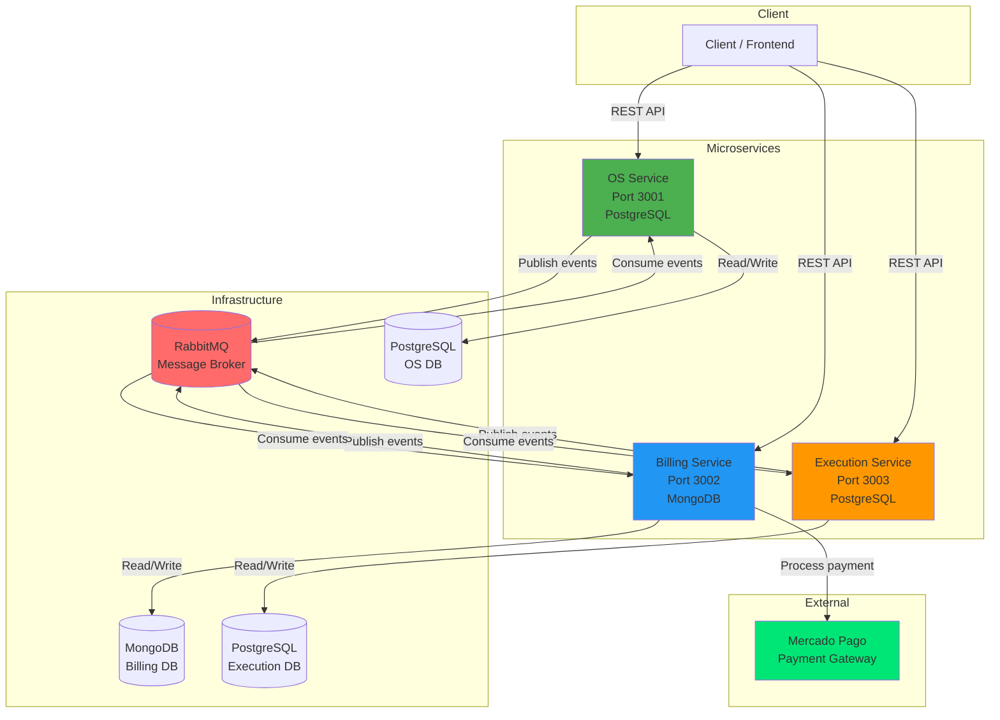

## 2. Saga Pattern — Happy Path

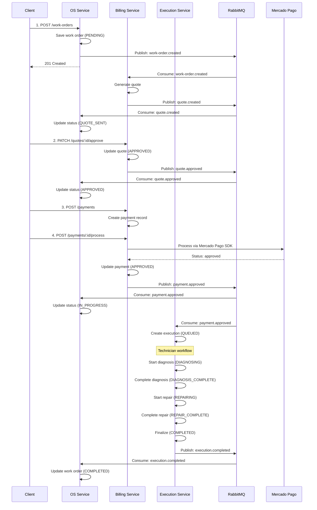

## 3. Saga Compensation — Payment Failure

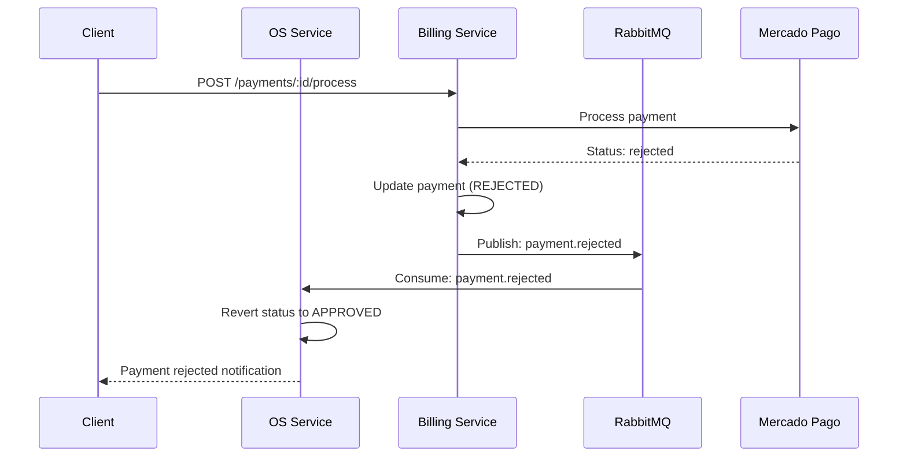

## 4. Saga Compensation — Work Order Cancellation

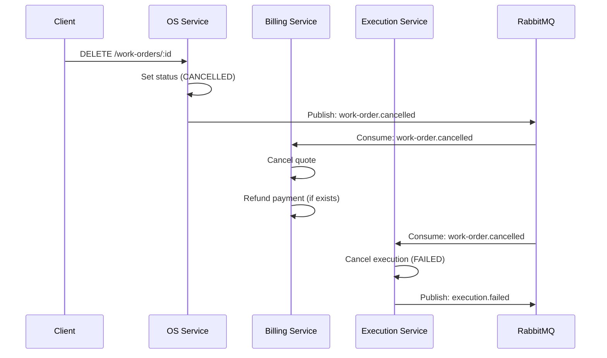

## 5. Work Order State Machine

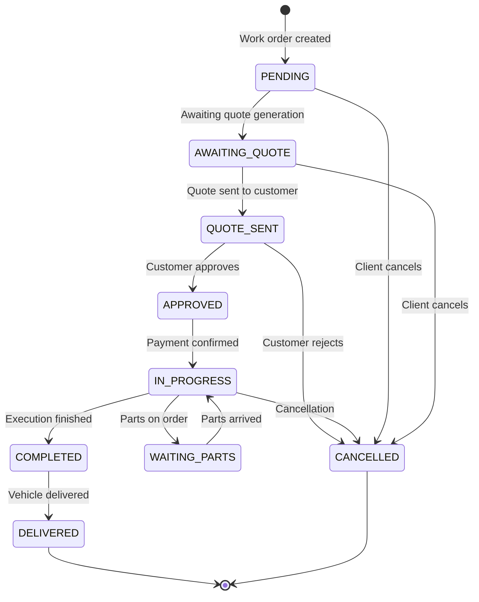

## 6. Execution State Machine

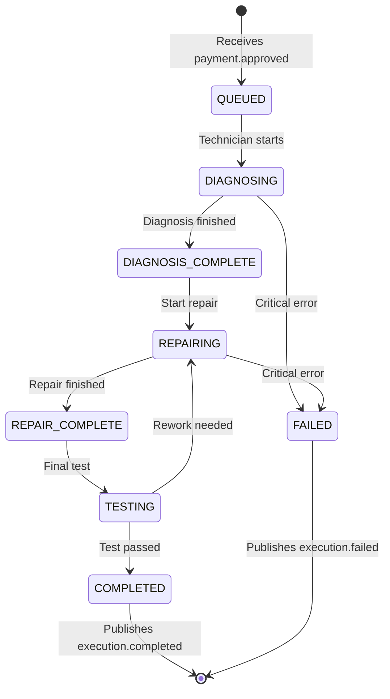

## 7. Billing Flow

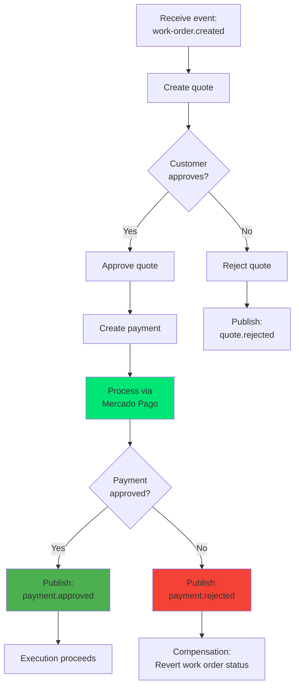

## 8. Event Topology

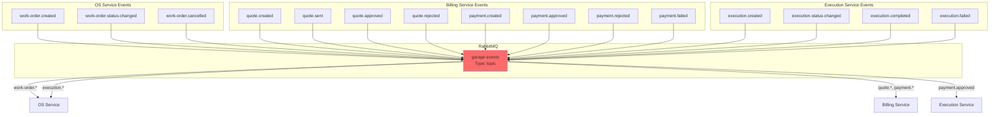

## 9. Data Models — OS Service (PostgreSQL)

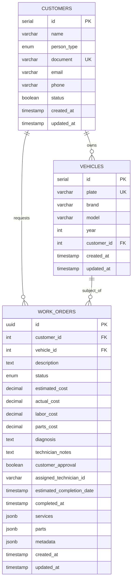

## 10. Data Models — Billing Service (MongoDB)

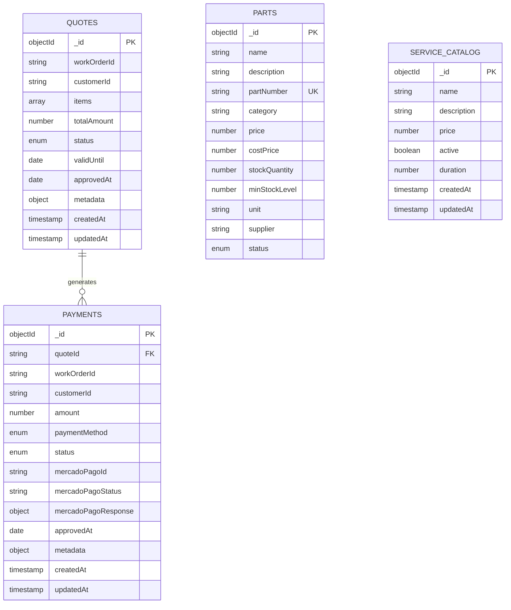

## 11. Data Models — Execution Service (PostgreSQL)

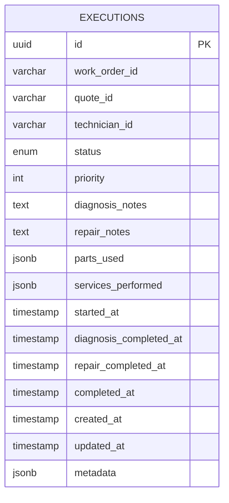

## 12. CI/CD Pipeline

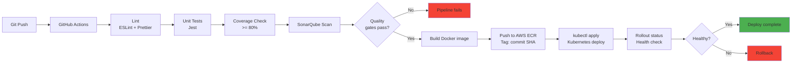

## 13. Kubernetes Topology

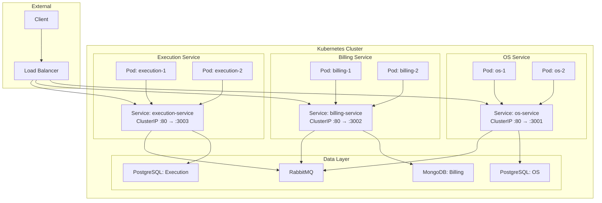

## 14. Mercado Pago Integration

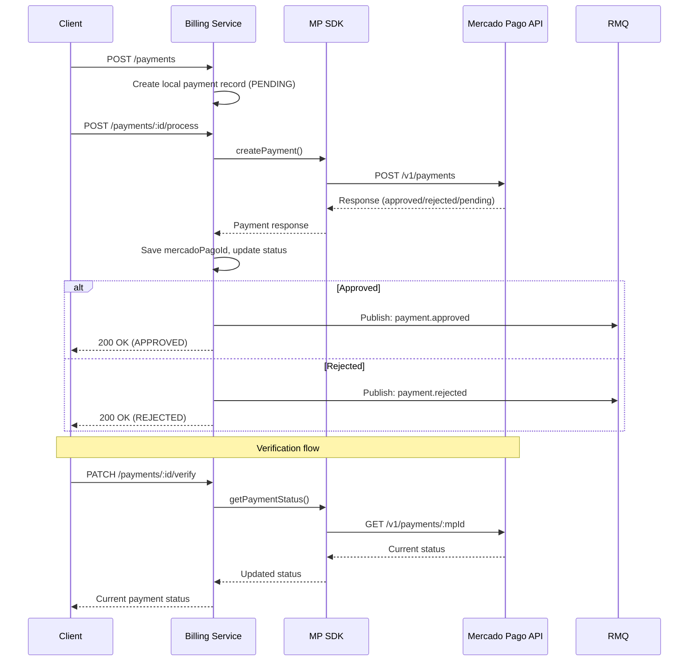

## 15. End-to-End Flow (Simplified)

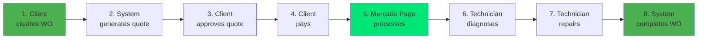

---

## Color Legend

| Color | Represents |
|-------|-----------|
| Green (#4CAF50) | OS Service |
| Blue (#2196F3) | Billing Service |
| Orange (#FF9800) | Execution Service |
| Red (#FF6B6B) | RabbitMQ / Message Broker |
| Light Green (#00E676) | Mercado Pago / External |
