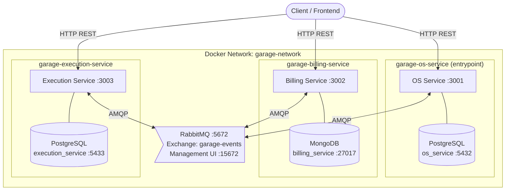
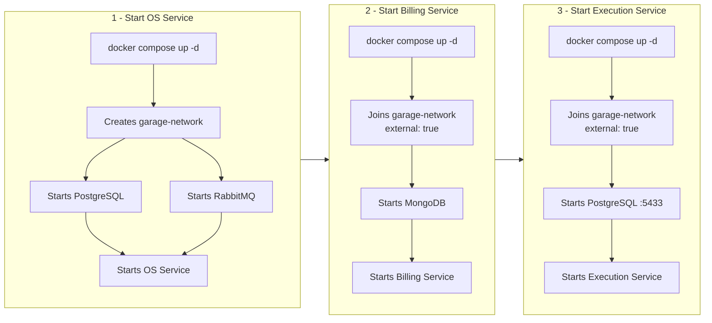
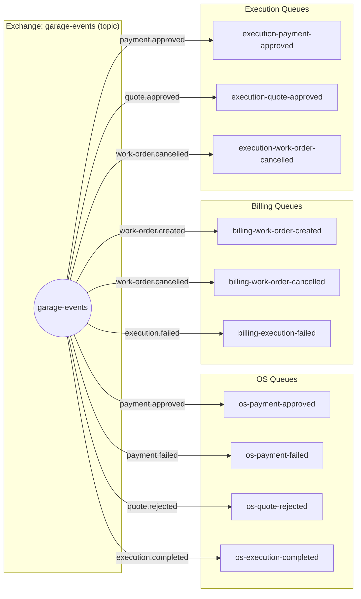
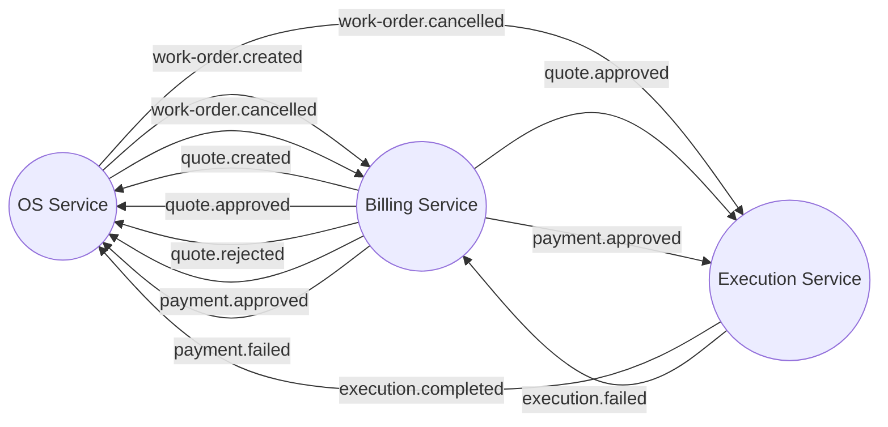
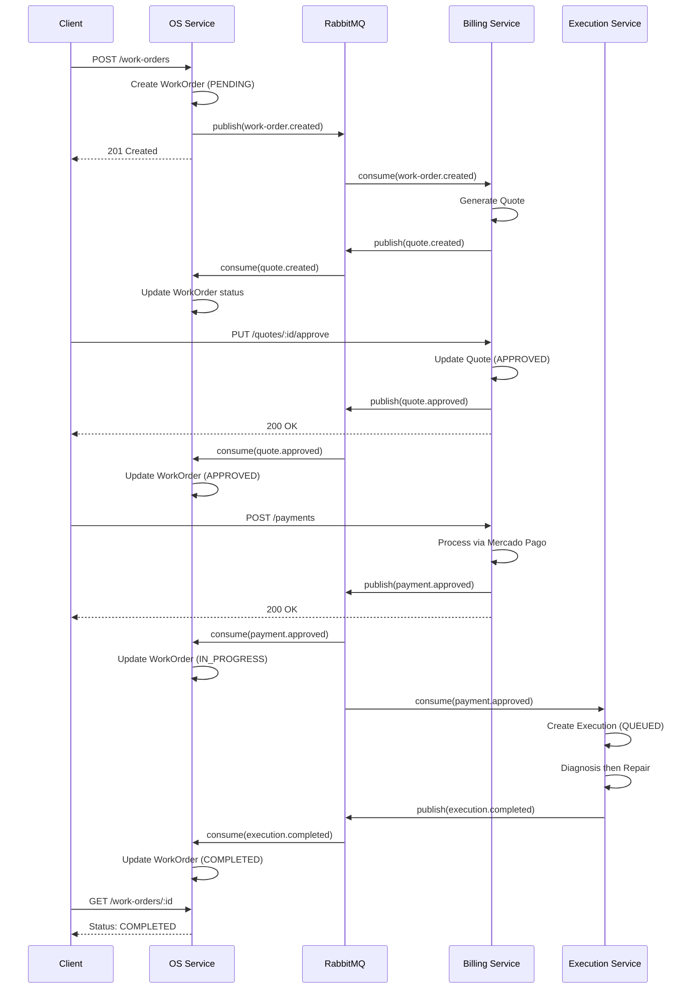
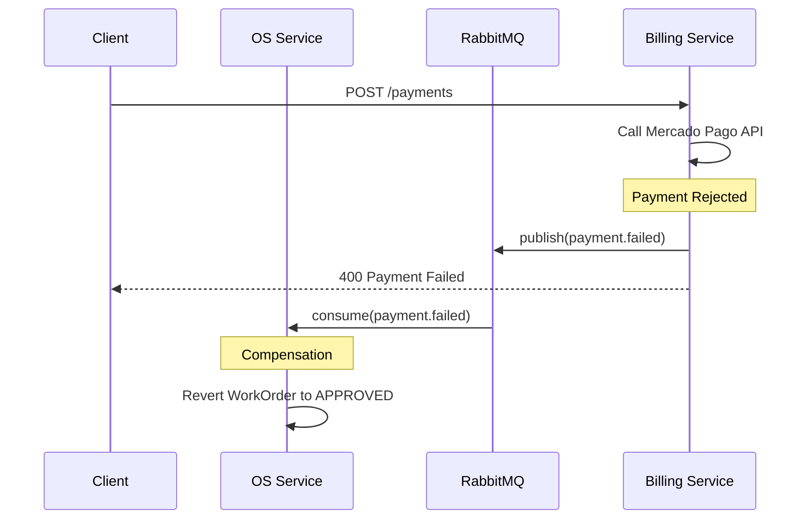
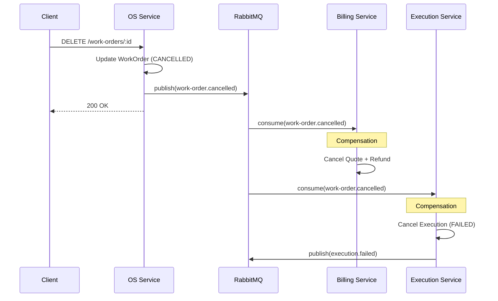
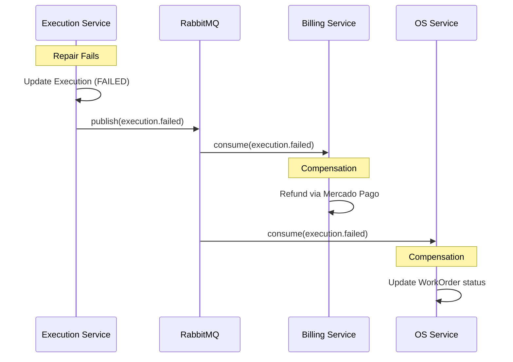
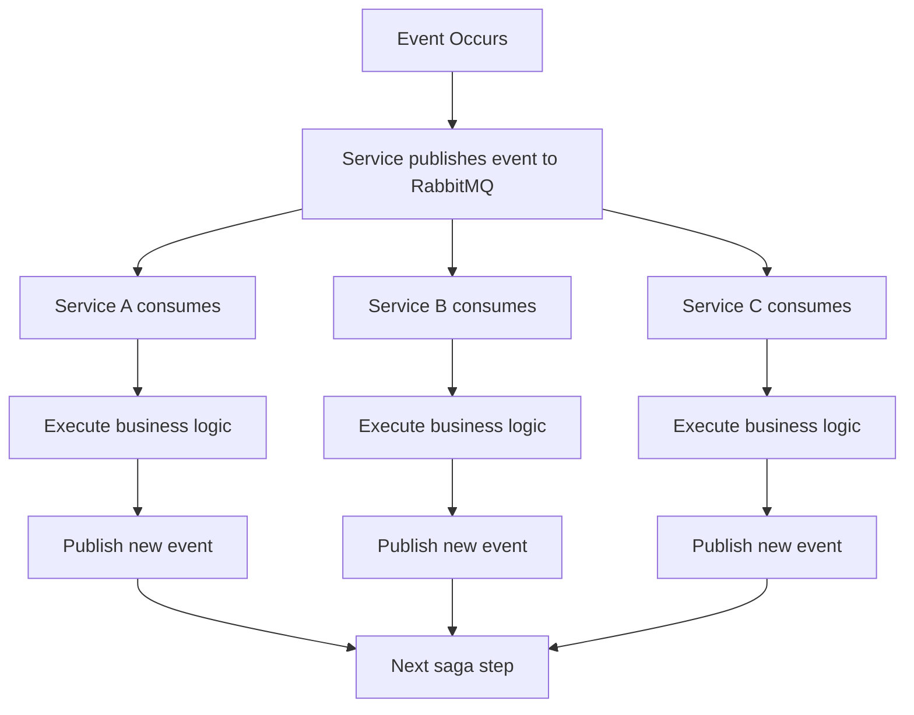

# Messaging Architecture - RabbitMQ

## Overview

The garage management system uses **RabbitMQ** for asynchronous inter-service communication. All three microservices connect to a **single shared RabbitMQ instance** to publish and consume events following a choreographed saga pattern.

## Architecture Decision: Single Shared RabbitMQ

The RabbitMQ instance is defined and owned by the **OS Service** (`garage-os-service`), which is the system entrypoint. The other services (`garage-billing-service` and `garage-execution-service`) connect to this same instance via a shared Docker network (`garage-network`).

### Why a Single Instance?

| Factor | Single RabbitMQ | Multiple RabbitMQ |
|--------|----------------|-------------------|
| **Event Distribution** | All services see all events | Events isolated per instance |
| **Infrastructure Complexity** | Simple - one broker to manage | Complex - multiple brokers to sync |
| **Resource Usage** | Efficient - shared resources | Wasteful - duplicate infrastructure |
| **Cost** | Lower | Higher (3x instances) |
| **Operational Overhead** | One monitoring point | Three monitoring points |
| **Message Routing** | Native topic exchange | Requires federation/shovel |

## System Architecture



## Docker Network & Startup



> **OS Service must be started first** -- it creates the `garage-network` and the shared RabbitMQ. The other services declare the network as `external: true`.

## RabbitMQ Exchange & Queues



### Exchange Details

| Parameter | Value |
|-----------|-------|
| **Name** | `garage-events` |
| **Type** | `topic` |
| **Durable** | `true` |
| **Auto-delete** | `false` |

### Queue Naming Convention

Format: `{service}-{event-subject}` -- clear ownership, no collisions, easy debugging.

## Event Catalog

| Event | Publisher | Consumers | Purpose |
|-------|-----------|-----------|---------|
| `work-order.created` | OS Service | Billing | Trigger quote generation |
| `work-order.status-changed` | OS Service | Billing, Execution | Sync work order state |
| `work-order.cancelled` | OS Service | Billing, Execution | Compensation: refund + cancel |
| `quote.created` | Billing | OS Service | Quote ready notification |
| `quote.approved` | Billing | OS, Execution | Proceed to payment / prepare execution |
| `quote.rejected` | Billing | OS Service | Cancel work order |
| `quote.sent` | Billing | OS Service | Track quote delivery |
| `payment.created` | Billing | -- | Internal audit |
| `payment.approved` | Billing | OS, Execution | Start work + begin execution |
| `payment.rejected` | Billing | OS Service | Revert to approved |
| `payment.failed` | Billing | OS Service | Compensation: revert state |
| `execution.created` | Execution | -- | Internal tracking |
| `execution.status-changed` | Execution | OS Service | Update work order progress |
| `execution.completed` | Execution | OS Service | Mark work order completed |
| `execution.failed` | Execution | Billing | Trigger refund |

## Service Publish / Consume Map



## Happy Path



## Compensation Scenarios (Saga)

### Payment Failure



### Work Order Cancellation



### Execution Failure



## Choreographed Saga Pattern



No central orchestrator. Each service reacts to events autonomously and publishes its own state changes.

## Message Format

All events follow this structure:

```json
{
  "eventId": "uuid-v4",
  "eventType": "work-order.created",
  "timestamp": "2026-02-08T10:00:00.000Z",
  "source": "os-service",
  "data": {
    "workOrderId": "uuid",
    "customerId": "uuid",
    "vehicleId": "uuid",
    "status": "PENDING",
    "description": "Oil change and tire rotation"
  }
}
```

## Service Subscriptions

### OS Service

**Publishes:** `work-order.created`, `work-order.status-changed`, `work-order.cancelled`

**Consumes:**

| Queue | Routing Key |
|-------|-------------|
| `os-payment-approved` | `payment.approved` |
| `os-payment-failed` | `payment.failed` |
| `os-quote-rejected` | `quote.rejected` |
| `os-execution-completed` | `execution.completed` |

### Billing Service

**Publishes:** `quote.created`, `quote.approved`, `quote.rejected`, `quote.sent`, `payment.created`, `payment.approved`, `payment.rejected`, `payment.failed`

**Consumes:**

| Queue | Routing Key |
|-------|-------------|
| `billing-work-order-created` | `work-order.created` |
| `billing-work-order-cancelled` | `work-order.cancelled` |
| `billing-execution-failed` | `execution.failed` |

### Execution Service

**Publishes:** `execution.created`, `execution.status-changed`, `execution.completed`, `execution.failed`

**Consumes:**

| Queue | Routing Key |
|-------|-------------|
| `execution-payment-approved` | `payment.approved` |
| `execution-quote-approved` | `quote.approved` |
| `execution-work-order-cancelled` | `work-order.cancelled` |

## Connection Details

| Parameter | Value |
|-----------|-------|
| **Protocol** | AMQP |
| **Host** | `rabbitmq` (via `garage-network`) |
| **Port** | 5672 (AMQP), 15672 (Management UI) |
| **Virtual Host** | `/` |
| **User / Password** | `guest` / `guest` (dev) |
| **Connection String** | `amqp://rabbitmq:5672` |

## Host Port Mapping

| Container | Internal Port | Host Port | Source Compose |
|-----------|---------------|-----------|----------------|
| postgres (OS) | 5432 | 5432 | garage-os-service |
| rabbitmq | 5672 / 15672 | 5672 / 15672 | garage-os-service |
| mongodb | 27017 | 27017 | garage-billing-service |
| postgres-execution | 5432 | 5433 | garage-execution-service |
| os-service | 3001 | 3001 | garage-os-service |
| billing-service | 3002 | 3002 | garage-billing-service |
| execution-service | 3003 | 3003 | garage-execution-service |

## Development Setup

All three repositories cloned side by side:

```bash
# 1. Start OS Service (creates garage-network + RabbitMQ + PostgreSQL)
cd garage-os-service
docker compose up -d

# 2. Start Billing Service (joins garage-network, starts MongoDB)
cd ../garage-billing-service
docker compose up -d

# 3. Start Execution Service (joins garage-network, starts PostgreSQL on :5433)
cd ../garage-execution-service
docker compose up -d
```

To stop:

```bash
cd garage-execution-service && docker compose down
cd ../garage-billing-service && docker compose down
cd ../garage-os-service && docker compose down   # removes garage-network
```

## Production (Kubernetes)

Deploy a single RabbitMQ StatefulSet in the shared namespace. All services reference it via internal DNS:

```
amqp://rabbitmq.garage-management.svc.cluster.local:5672
```

## Monitoring

- **Management UI:** `http://localhost:15672` -- credentials: `guest`/`guest`
- **Expected connections:** 3 (one per service)
- **Queue depth:** should stay low if services are processing

### Debugging

```bash
# Check all services are on the same network
docker network inspect garage-network

# Check queues and connections
docker exec garage-os-service-rabbitmq-1 rabbitmqctl list_queues
docker exec garage-os-service-rabbitmq-1 rabbitmqctl list_connections
```

## Why Messaging vs HTTP?

| Factor | Messaging (RabbitMQ) | HTTP |
|--------|---------------------|------|
| **Coupling** | Loose | Tight |
| **Resilience** | Messages queued if consumer down | Fails if service down |
| **Scalability** | Easy to add consumers | Requires load balancer |
| **Async Workflows** | Native | Requires polling/webhooks |
| **Saga Pattern** | Natural fit | Complex orchestration |

## Best Practices

1. **Idempotency** -- handlers safe to process the same message multiple times
2. **Message Acknowledgment** -- always ack after successful processing
3. **Error Handling** -- use dead-letter queues for failed messages
4. **Monitoring** -- track message rates and queue depths
5. **Versioning** -- include event version for future schema changes
6. **Logging** -- log all events with correlation IDs
7. **Security** -- use TLS (`amqps://`) in production
8. **Credentials** -- store in secrets manager, never hardcode
